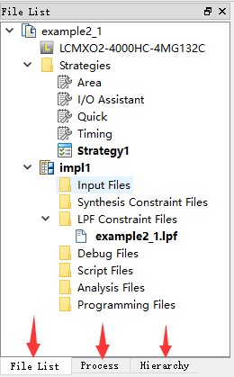
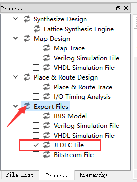

流程熟悉
===========

新建工程
------------

1. 打开Diamond，界面如下图所示： 

2. 点击Files->New->Project...

3. 设置工程名称和存放的路径：

4. 添加源文件，这一步跳过：

5. 选择器件型号：

.. image:: pic/2-5.png

* Family 是指芯片的系列，这里用的是MachXO2系列。
* Device 是指这个系列里的具体器件，这里是4000HC。（4000是跟FPGA的容量相关的，数值越大容量越大）
* Performance Grade 是指芯片的速度等级，一般数值越小速度越快。
* Package Type 是指芯片的封装，这里选择的是BGA132。（从名称可以推测是BGA封装，132个管脚）
* Operation Conditions 是指工作温度，这里选择Commercial（商业级的）即可。
* Part Name 最后再核对一下芯片的PartName，是否与实际板上的芯片一致。

6. 选择综合工具：

* 默认Lattice SE即可。（后面会解释什么是“综合(Synthesis)”）

7. 最后点击Finish，完成。

添加源文件
--------------

1、注意一下左侧的这个工作区：

2、新建源文件，点击File->New->Files...

3、选择文件类型为Verilog File，文件名为top(或其它任何有意义的名称)，然后Next

4、编写源文件，内容举列如下::

	module top(
		input             clk,
		output reg  [7:0] led
	);
	always@(posedge clk) begin
		led <= 8'hF0;
	end
	endmodule

5、切换到Process菜单下，双击Synthesize Design前面的箭头进行综合。

6、如果编写的源文件没有任何错误，箭头会变绿，表示综合成功：

7、反之，如果显示红色的，表示有错误：

要去Output窗口下面看输出信息，错误在哪，并修改错误，然后再尝试综合，直到通过为止。

分配引脚
-----------

FPGA与单片机一个最大的不同就是，FPGA的GPIO可以任何分配。我们可以将自己设计的功能，分配到任意的引脚上去。

1、打开lpf引脚配置文件：

2、然后粘贴以下内容::

	LOCATE COMP "clk"    SITE "C1" ;
	LOCATE COMP "led[7]" SITE "N13" ;
	LOCATE COMP "led[6]" SITE "M12" ;
	LOCATE COMP "led[5]" SITE "P12" ;
	LOCATE COMP "led[4]" SITE "M11" ;
	LOCATE COMP "led[3]" SITE "P11" ;
	LOCATE COMP "led[2]" SITE "N10" ;
	LOCATE COMP "led[1]" SITE "N9" ;
	LOCATE COMP "led[0]" SITE "P9" ;

这里我们将上一步源文件中的led信号，与板子上的8个LED一一对应起来。（具体引脚位置可参照小脚丫的包装盒）

编译
-----------

1、切换到Process菜单，将JEDEC前面的勾打上，然后双击Export Files：

2、如果没有问题，会一路执行下来：

Synthesize Design：综合，可以理解成将Verilog语言翻译成FPGA能理解的数字逻辑这一过程。[#f1]_

Map Design：映射，可以理解成将上一步综合出来的逻辑单元，与FPGA中的真实资源(如RAM、选择器、寄存器之类的)相对应起来。[#f2]_

Place & Route： 布局布线，可以理解为将这些资源安放到FPGA中，再用导线将它们连接起来。[#f3]_

Export File： 将最后的的布局布线结果，生成可供下载的二进制文件。[#f4]_

下载
------

把小脚丫连接到电脑的USB口上。

1、点击Tools->Programmer，或菜单上对应图像的快捷按钮

2、第一次打开Programmer，会让你选择下载器：

* 注意：选择带FTDI的。

3、点击这里的JTAG Scan，如果连接正常，应该扫描到FPGA：

* 注意：在要黄色的地方再点击一下，选择4000HC的片子！

4、Opertion选择默认的(Flash ERASE,Program,Verify)，File Name要选择当前工程的imp1目录下的jed文件。

5、然后点击Program，下载成功后会提示“INFO - Operation: successful.”

6、Program完成后，板子上的LED应该会亮起来一半。

7、尝试调整代码中给LED赋的值，看看LED的状态有什么变化。

.. rubric:: 注：

.. [#f1] 可以参照电路设计中，将电路图导出网表的这一过程
.. [#f2] 可以参照电路设计中，将网表导入PCB并分配封装的这一过程
.. [#f3] 可以参照电路设计中，PCB的布局布线这一过程
.. [#f4] 可以参照电路设计中，导出Gerber文件这一过程
