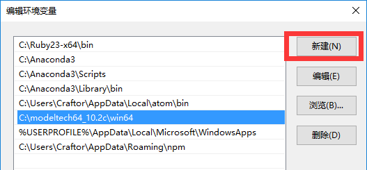
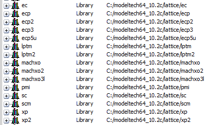

准备
=====

关于HDL的仿真工具有很多，在Windows平台下最受欢迎的是Modelsim。本书的仿真教程将会以Modelsim作为仿真工具为大家讲解。

Modelsim下载
---------------

链接: http://pan.baidu.com/s/1o7IidIy 密码: uvbm

Modelsim安装
----------------

Modelsim的安装过程比较简单，如果不清楚的请自行百度或谷歌。

Modelsim配
-------------

Modelsim安装好后，要将安装目录下的win64文件夹添加到系统环境变量PATH中。如作者电脑上安装目录是::
	
	C:\modeltech64_10.2c\win64

在Win10系统下，右键“我的电脑”->系统->高级系统设置->高级->环境变量，然后找到用户变量中的“PATH”并双击，将上面modelsim的路径添加进去，添加完成了如下图所示。

如果是Win7系统，则要将原来PATH中的一大串字符最后加上一个英文分号，再将modelsim的路径粘贴到后面。

检查modelsim有没有配置成功：在任意文件夹下，Shift+右键->“在此处打开命令行窗口”，然后在命令行中输入vsim，如果能成功启动modelsim，则说明配置正常。反之，请再检查上面的步骤是否有误。

Lattice库配置
---------------

找到Lattice Diamond安装目录，如作者电脑上是::

	C:\lscc

然后到modelsim目录下，新建lattice文件夹，进入并添加sim.tcl文件，输入如下内容::

	set DIAMOND_PATH C:/lscc/diamond/3.7_x64/cae_library/simulation/verilog
	vlib work
	vlib ec
	vlib ecp
	vlib ecp2
	vlib ecp3
	vlib ecp5u
	vlib lptm
	vlib lptm2
	vlib machxo
	vlib machxo2
	vlib machxo3l
	vlib pmi
	vlib sc
	vlib scm
	vlib xp
	vlib xp2
	vlog -work ec       $DIAMOND_PATH/ec/*.v
	vlog -work ecp      $DIAMOND_PATH/ecp/*.v
	vlog -work ecp2     $DIAMOND_PATH/ecp2/*.v
	vlog -work ecp3     $DIAMOND_PATH/ecp3/*.v
	vlog -work ecp5u    $DIAMOND_PATH/ecp5u/*.v
	vlog -work lptm     $DIAMOND_PATH/lptm/*.v
	vlog -work lptm2    $DIAMOND_PATH/lptm2/*.v
	vlog -work machxo   $DIAMOND_PATH/machxo/*.v
	vlog -work machxo2  $DIAMOND_PATH/machxo2/*.v
	vlog -work machxo3l $DIAMOND_PATH/machxo3l/*.v
	vlog -work pmi      $DIAMOND_PATH/pmi/*.v
	vlog -work sc       $DIAMOND_PATH/sc/*.v
	vlog -work scm      $DIAMOND_PATH/scm/*.v
	vlog -work xp       $DIAMOND_PATH/xp/*.v
	vlog -work xp2      $DIAMOND_PATH/xp2/*.v

然后在lattice目录下，Shift+右键，打开命令行，输入::

	vsim -do sim.tcl

如果没有错误，会看到modelsim一直在编译，直到结束。这时候，会在modelsim里看到lattice的库：

然后再回到modelsim根目录下，找到modelsim.ini文件，右键去掉“只读”属性，然后再打开。

在[Library]这个标签后，添加如下::

	ec       = $MODEL_TECH/../lattice/ec       
	ecp      = $MODEL_TECH/../lattice/ecp      
	ecp2     = $MODEL_TECH/../lattice/ecp2     
	ecp3     = $MODEL_TECH/../lattice/ecp3     
	ecp5u    = $MODEL_TECH/../lattice/ecp5u    
	lptm     = $MODEL_TECH/../lattice/lptm     
	lptm2    = $MODEL_TECH/../lattice/lptm2    
	machxo   = $MODEL_TECH/../lattice/machxo   
	machxo2  = $MODEL_TECH/../lattice/machxo2  
	machxo3l = $MODEL_TECH/../lattice/machxo3l
	pmi      = $MODEL_TECH/../lattice/pmi      
	sc       = $MODEL_TECH/../lattice/sc       
	scm      = $MODEL_TECH/../lattice/scm      
	xp       = $MODEL_TECH/../lattice/xp       
	xp2      = $MODEL_TECH/../lattice/xp2

保存之后，关闭原来打开的Modelsim。再到桌面上，Shift+右键，打开命令行，输入vsim启动modelsim。如果左侧库里能看到lattice的相关库，则说明库配置成功了。

Altera库配置
------------

TODO

